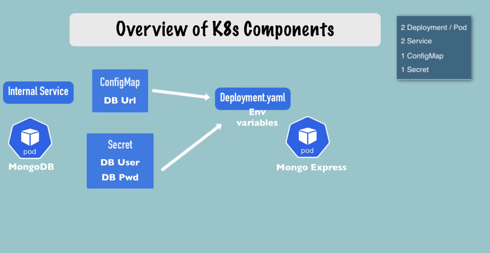

# Deploy k8s app:

A simple setup to of web-app and it's database. 
We're going to deploy 2 applications **mongoDB** and **mongo-express**

1. Create *mongoDB* pod(deployment).
    - in order to talk to the pods create *service*.
    - mongoDB will have an **internal service**, means -
        - no external requests are allowed to the pod.
        - only components inside the same cluster can talk to it.
1. Create *mongo-express* deployment.
    - here we need *db-url*, *db-user* and *db-password*
    - as we need mongo express accessible through browser we need a **external service** here.

---

## Browser Request flow
1. request comes from the browser
2. then it will go to the *external service* of mongo-express
3. It will then forward it to mongo-express **pod**
4. then the pod will connect to *internal service* of **mongo db**
5. then forward it to mongoDB **pod**
6. the pod will authenticate the req using the credentials. 
 

---

